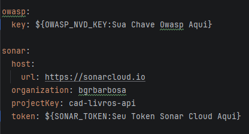
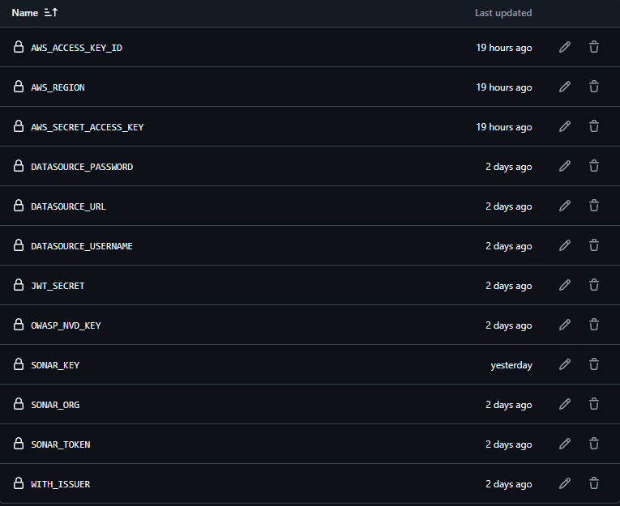

# CADASTRO DE LIVROS - API

Projeto utilizado para controle de livros, onde suas principais funções são: inserção, alteração, deleção e busca de livros cadastrados no nosso catálogo.
<br><br>
Este README descreve como montar o ambiente localmente e com Docker, além de explicar a pipeline de CI/CD (verificação de código, análise de vulnerabilidade OWASP, SonarCloud e deploy na AWS).

---

## 1) Sobre o projeto

Este projeto é uma aplicação backend construída com Spring Boot 3.4.2 com banco de dados PostgreSQL. 

Foi criado para estudos e demonstração de boas práticas em:

- Estrutura de projeto Spring (controllers, services, repositories)
- Integração com banco de dados PostgreSQL (JPA / Hibernate)
- Análise de vulnerabilidades OWASP (Dependency-Check)
- Testes automatizados (Testes Unitários com Mockito e Testes de Integração com MockMVC)
- Análise de cobertura e qualidade de código com Sonar
- Dockerização da aplicação e do banco de dados
- Pipeline de CI/CD com GitHub Actions: verificação de código, análise de vulnerabilidades OWASP, análise de qualidade/cobertura no SonarCloud
- Deploy automatizado na AWS a partir da branch `main`

Obs.: Este repositório é destinado a fins de aprendizado.

---

## 2) Tecnologias utilizadas

- Java 21
- Spring Boot 3.4.2 (Spring Framework 6)
- Spring Data JPA (Hibernate)
- PostgreSQL (12+ recomendado)
- Maven
- Docker & Docker Compose
- Git / GitHub
- GitHub Actions (CI/CD)
- SonarQube - Para análises de análise de qualidade e cobertura em ambiente local e SonarCloud - Análise de qualidade e cobertura na nuvem
- OWASP Dependency-Check (análise de dependências/vulnerabilidades) ou OWASP ZAP (para testes de segurança HTTP)
- AWS: Elastic Beanstalk - Para deploy automático, RDS para banco de dados

---

## 3) Ferramentas necessárias

Instale localmente:
- JDK 21
- Maven 3.8+
- Docker (com Docker Compose)
- Git
- (Opcional) AWS CLI, para deploy manual / testes locais com AWS
- (Opcional) Postman / Insomnia para testar endpoints

Variáveis de ambiente / secrets necessários - Para ambientes locais o sistema já vem pré configurado

- PORT: Porta que a aplicação irá rodar (padrão 8080)
- DATASOURCE_URL: URL de conexão com o banco de dados (ex.: jdbc:postgresql://localhost:5432/appdb)
- DATASOURCE_USERNAME: Username do banco de dados (ex: postgres)
- DATASOURCE_PASSWORD: Senha do banco de dados (ex: senha123)
- JWT_SECRET: Secreto para assinatura de tokens JWT
- WITH_ISSUER: Issuer para tokens JWT
- OWASP_NVD_KEY: Chave de API para OWASP NVD (opcional, para Dependency-Check)
- SONAR_TOKEN (para SonarCloud): Token de autenticação para o SonarCloud
- AWS_ACCESS_KEY_ID: Chave de acesso AWS para deploy
- AWS_SECRET_ACCESS_KEY: Chave secreta AWS para deploy
- AWS_REGION: Região AWS (ex.: us-east-1)

No GitHub Actions você também precisará configurar os Secrets correspondentes (Settings > Secrets) para rodar a pipeline de CI/CD.

---

## 4) Passo a passo para a montagem de ambiente

Ambiente Local: sem Docker    
    
#### 4.1 Clonar o repositório:
   ```bash 
    git clone https://github.com/bgrbarbosadev/cad-livros-api.git
    cd cad-livros-api
   ```
#### 4.2 Configurar banco de dados local (Postgres):
   
Instale o PostgreSQL localmente ou através de uma imagem docker   
Crie um banco e um usuário - Exemplo de script para criação automática do Database e usuários: `scripts/db/init-db.sql`
   
#### 4.3 Configurar o valor da chave o OWASP NVD e o Token do SonarCloud para análise de vulnerabilidades e qualidade de código 
  
      - Recomenda-se configurar essas variáveis de ambiente no seu sistema operacional ou usar um arquivo `.env`  <br><br>   
    
        OWASP_NVD_KEY: valor_da_chave <br>
        SONAR_TOKEN: valor_do_token <br><br>
   
   - Ou no arquivo application.yml conforme exemplo abaixo:   
        

#### 4.4. Build e execução com maven:

```bash
mvn clean install -DskipTests
mvn spring-boot:run
      
```

#### 4.5. Executar testes e análise de vulnerabilidades:

```bash
Testes unitários e de integração com cobertura:
   
Profile de Sonar local: mvn clean install -Psonar
Profile de Sonar Cloud: mvn clean install -Psonar-cloud
Profile de Análise de Vulnerabilidades: mvn clean install -Powasp -DskipTests
   
Relatórios de cobertura estará em: `target/site/jacoco/index.html`.  
```

```bash
Montagem de ambiente com Docker (recomendado para consistência):

docker-compose up --d
      
Obs: Arquivo docker-compose.yml está na raiz do projeto.
```


#### 4.6 Após a execução dos passos acima, a aplicação ficará disponível em `http://localhost:8080`

Observações:
- A porta na URL será a 8080 que é a padrão, mas pode ser alterada conforme configuração na variável de ambiente `PORT` ou no arquivo `application.yml`
- A documentação dos endpoints está disponível em `http://localhost:8080/swagger-ui.html` ou `http://localhost:8080/swagger-ui/index.html`
- Para os testes da aplicação, as colections para uso no postman encontram-se na raiz do projeto: postman-colection.json
---

## 5) Gerando alterações e pipeline no GitHub

#### 5.1) Fluxo desejado:
    
#### 5.2) Você desenvolve em uma branch de trabalho (por ex.: `feature/minha-feature`).
    
#### 5.3) Abre um Pull Request (PR) contra a branch `homologacao`.
    
#### 5.4) A pipeline de CI é executada no PR -> validações:
        - Verificação do código (format, lint, checkstyle, spotbugs)
        - Execução de testes unitários e de integração
        - Análise de vulnerabilidade OWASP (Dependency-Check) contra dependências
        - Análise de qualidade e cobertura no SonarCloud (verificar cobertura mínima)
    
#### 5.5) Se o PR é aprovado e mesclado em `homologacao`, podemos ter por política um ciclo de homologação manual/automático.
    
#### 5.6) Quando a branch `homologacao` for mergeada para `main`, um outro workflow do GitHub Actions é acionado para deploy na AWS.
    
#### 5.7) Crie um Environment chamado `cad-livros-api`, crie e configure as secrets abaixo:

---

## 6) Autoria e contato

Autor: Bruno Gaspar Romeiro Barbosa / bgrbarbosadev  
Email: bgrbarbosa@hotmail.com  
Telefone: +55 (24) 98854-9631

---

## Licença

Este repositório é para estudos e está disponível sob uma licença permissiva. Abaixo o texto da MIT License (cópia livre). Sinta-se à vontade para usar e modificar o código.

Licença MIT

Copyright (c) 2026 Seu Nome

É concedida permissão, gratuitamente, a qualquer pessoa que obtenha uma cópia
deste software e arquivos de documentação associados (o "Software"), para lidar
com o Software sem restrições, incluindo, sem limitação, os direitos
de usar, copiar, modificar, fundir, publicar, distribuir, sublicenciar e/ou vender
cópias do Software, e para permitir que as pessoas a quem o Software é
fornecido o façam, sujeitas às seguintes condições:

O aviso de direitos autorais acima e este aviso de permissão devem ser incluídos em todas as
cópias ou partes substanciais do Software.

O SOFTWARE É FORNECIDO "NO ESTADO EM QUE SE ENCONTRA", SEM GARANTIA DE QUALQUER TIPO, EXPRESSA OU
IMPLÍCITA, INCLUINDO, MAS NÃO SE LIMITANDO ÀS GARANTIAS DE COMERCIALIZAÇÃO,
ADEQUAÇÃO A UM FIM ESPECÍFICO E NÃO VIOLAÇÃO. EM NENHUMA HIPÓTESE OS
AUTORES OU DETENTORES DOS DIREITOS AUTORAIS SERÃO RESPONSÁVEIS POR QUAISQUER REIVINDICAÇÕES, DANOS OU OUTRAS
RESPONSABILIDADES, SEJA EM AÇÃO CONTRATUAL, EXTRACONTRATUAL OU DE OUTRA NATUREZA, DECORRENTES DE,
OU RELACIONADAS COM O SOFTWARE OU O USO OU OUTRAS NEGOCIAÇÕES COM O
SOFTWARE.

---

## Recursos & referências

- Spring Boot: https://spring.io/projects/spring-boot
- SonarCloud: https://sonarcloud.io
- OWASP Dependency-Check: https://owasp.org/www-project-dependency-check/
- GitHub Actions: https://docs.github.com/actions
- Docker: https://www.docker.com/
- AWS: https://aws.amazon.com/

---
